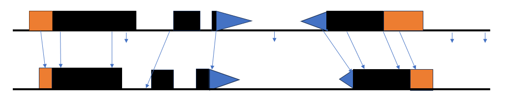

# How to use GAinSAW tools  



The figure depicts the tasks **GAinSAW** tools are designed to help solve.
The upper line represents a "query genome," with gene models displayed in conventional ways: exons as boxes above the line; 5'- and 3'-untranslated regions (UTRs) in orange and blue, respectively; coding regsions (CDS) in black.
You have a set of points of interest on the query genome that you want to map onto a "target" genome (bottom line).
Long arrows represent successful "liftovers," with connected points identifying matching positions according to an input genome alignment (in form of a [chain file](REF)) and short arrows representing query points that can not be lifted.

**GAinSAW** input consists of the genome sequences, the corresponding genome annotations, a genome alignment chain file, and a set of query genome points.
**gainsaw** is a python package which adapts functions from the [pyliftover](https://github.com/konstantint/pyliftover) package by Konstantin Tretyakov to identify matched points (_i.e._, points that fall withing alignment blocks according to the input chain file) and then has added functionality to select and annotate subsets of these points based on specified filtering criteria.

There are two ways of accessing **gainsaw** functions: (1) the python script _xgainsaw_ provides a command line interface to **gainsaw** functions; (2) the python package **gainsaw** can be imported into a custom python script that accesses **gainsaw** functions directly.
These alternatives are illustrated in separate sections below.


## Prerequisites
The instructions below assume that you have successfully followed the [**GAinSAW** installation instructions](./INSTALL.md) and are executing commands in your **gainsaw** conda environment.

Alternatively, you can download the [GAinSAW.sif](https://brendelgroup.org/SingularityHub/GAinSAW.sif) apptainer and run all the _xgainsaw_ commands within the container; see [README.md](./README.md).


## Command line interface
```bash
conda activate gainsaw
```


### test01
The following _liftover_ command creates a _LiftOver_ object connecting mouse _mm10_ to mouse _mm39_ coordinates according to the _mm10ToMm39.over.chain_ genome alignment.
The object is saved in a python pickle labeled _mm10ToMm39_ in the _work.conf_ **gainsaw** configuration file, stored in the _data_ directory.

The second command creates a _pointset_ entry in the _work.conf_ configuration file that links _test/mm10.Ctbp.bed_ query points with coordinates in the _mm39_ genome.
```bash
xgainsaw liftover -i data/liftovers/mm10ToMm39.over.chain.gz -o mm10ToMm39 -d data -c work.conf
xgainsaw pointset -p test/mm10.Ctbp.bed -l mm10ToMm39 -d data -c work.conf
```

### test02
This command shows the outcome of the previous command by displaying the pairs of query and target points.
```bash
xgainsaw check -p mm10.Ctbp -n 0 -d data -c work.conf
```

### test03
Another liftover, in this case from _mm39_ to rat _rn7_.
```bash
xgainsaw liftover -i data/liftovers/mm39chr5and7ToRn7.over.chain -o mm39chr5and7ToRn7 -d data -c work.conf
```

### test04
The first command creates a _PointSet_ object that connects the _mm39_ points specified in file _mm39.Ctbp.bed_ with their equivalents in the target rat _rn7_ genome.
The label _mm39chr5and7ToRn7_ is used to look up (in _work.conf_) the location of the _LiftOver_ object created by _test03_. 
The _check_ command shows the outcome.
The _align_ command puts out the alignment block (parameter _s 0_) alignments into file _tout04_.
```bash
xgainsaw pointset -p test/mm39.Ctbp.bed -l mm39chr5and7ToRn7 -d data -c work.conf
xgainsaw check -p mm39.Ctbp -n 0 -d data -c work.conf
xgainsaw align -q mm39 -t rn7 -p mm39.Ctbp -s 0 -d data -c work.conf > tout04
```

### test05
The first command creates a _PointSet_ object that connects the _mm39_ points specified in file _mm39.Ctbp-points.bed_ with their equivalents in the target rat _rn7_ genome.
The _align_ command re-aligns the sequences around the lifted points (25 bases to each side) using the _lastz_ scoring scheme and saves the output in file _tout05_.
```bash
xgainsaw pointset -p test/mm39.Ctbp-points.bed -l mm39chr5and7ToRn7 -d data -c work.conf
xgainsaw align -q mm39 -t rn7 -p mm39.Ctbp-points -s 25 -x lastz -r -d data -c work.conf > tout05
```

### test06
This command re-aligns the points from _test05_, now using windows of 50 bases to each side and the default scoring scheme.
```bash
xgainsaw align -q mm39 -t rn7 -p mm39.Ctbp-points -s 50 -x default -r -d data -c work.conf > tout06
```

### test07 - Filtering
This block of commands explores the filtering options of _xgainsaw filter_.
```bash
xgainsaw pointset -p test/mm39randomSNPs.bed -l mm39chr5and7ToRn7 -d data -c work.conf
```

First, we set the filter level to 3 for all points.
There are 37 accepted points and 13 unlifted points:
```bash
xgainsaw filter -q mm39 -t rn7 -p mm39randomSNPs -s  0 -r 100 --set_filter_level 3 -m 'at_least' --use_filter_level 0 -n 0 -d data -c work.conf > tout07a
```

Second, we filter with slop size 50 and allowed mismatch rate 10%.
There are 4 qualifed points (set to level 2).
10 points are accepted at level 1 (within bounds).
```bash
xgainsaw filter -q mm39 -t rn7 -p mm39randomSNPs -s 50 -r  10 --set_filter_level 2 -m 'at_least' --use_filter_level 1 -n 0 -d data -c work.conf > tout07b
```

Here we use the same criteria as before except setting and accepting points at level 3.
The output shows the 4 accepted points.
```bash 
xgainsaw filter -q mm39 -t rn7 -p mm39randomSNPs -s 50 -r  10 --set_filter_level 3 -m 'equal'    --use_filter_level 3 -n 0 -d data -c work.conf > tout07c
```

Successive filtering: lowering the match rate to 8% on the previously accepted set, there are 2 accepted points at the new level:
```bash
xgainsaw filter -q mm39 -t rn7 -p filtered_s50m10_equal_3_accepted_mm39randomSNPs -s 50 -r 8 --set_filter_level 4 -m 'equal'    --use_filter_level 4 -n 0 -d data -c work.conf > tout07d
```

### Cleanup:
The above filtereing has produced 20 _.bed_ and _.pkl_ files, with awfully long names.
This is nice as a reminder of how the ouptut was produced, but otherwise awkward.
We suggest putting these files aside, selecting what is useful for further study, and then just working with those files, renamed to something more convenient.
```bash
mkdir FILTERED
mv filtered*.pkl accepted*.bed unlifted*.bed  FILTERED/
```


## Python scripts calling the gainsaw package

First, we need to activate our _gainsaw_ environment and change into the _test_ directory:
```bash
conda activate gainsaw
cd test
```

### test00.py
Let's make sure that we can import the _gainsaw_ package:
```bash
python test00.py
```

What's in test00.py:
```bash
import gainsaw
```

Expected output:
```bash
gainsaw version:  0.1 
```

### tests test01.py .. test08b.py
Please proceed with the additional test scripts in similar fashion.
Each script is commented and explains what functions are called for what purpose.
You can run all tests by executing
```bash
./xinitialtests
```
or subsequently
```bash
./xtestall
```
and compare the output with the expected output in files _good*_.
